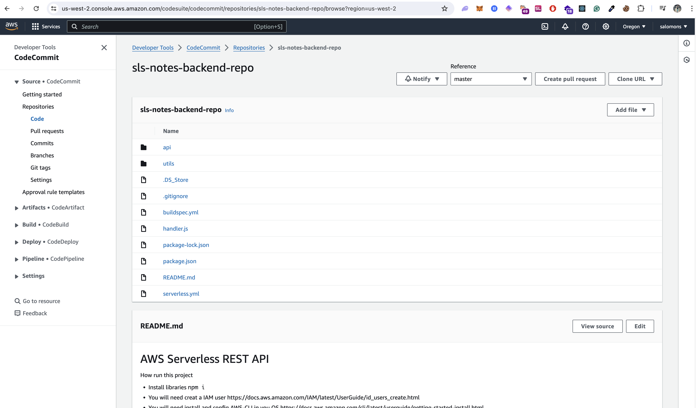
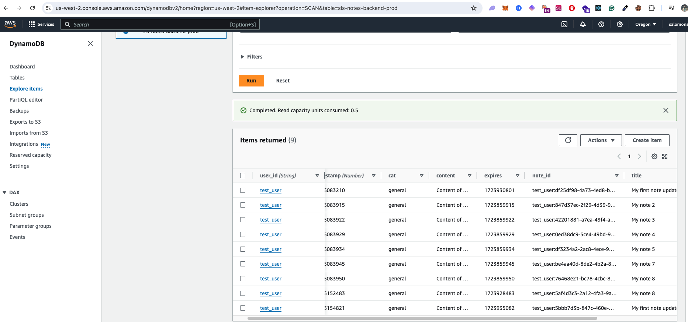
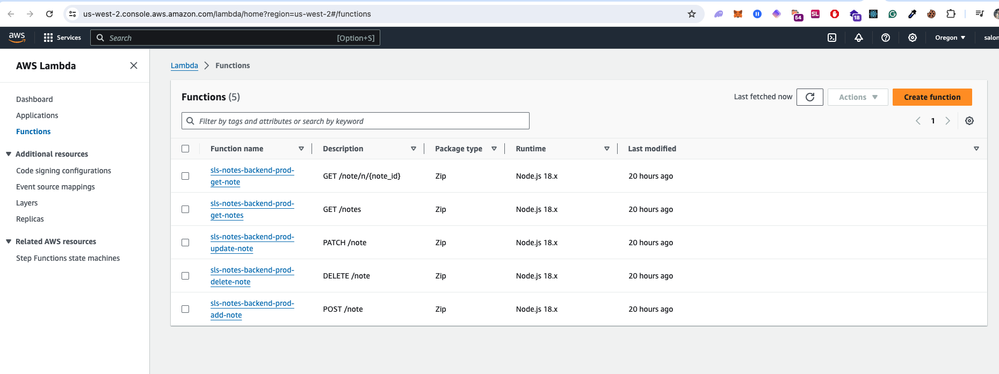
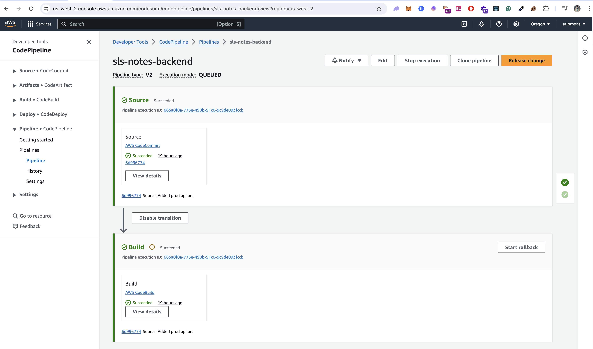
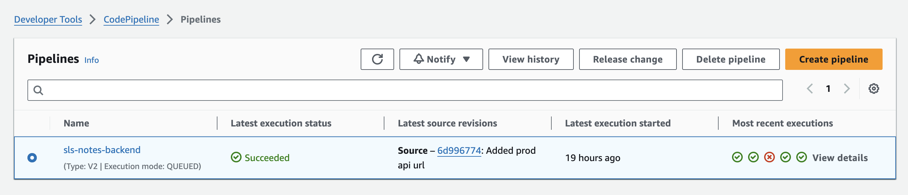
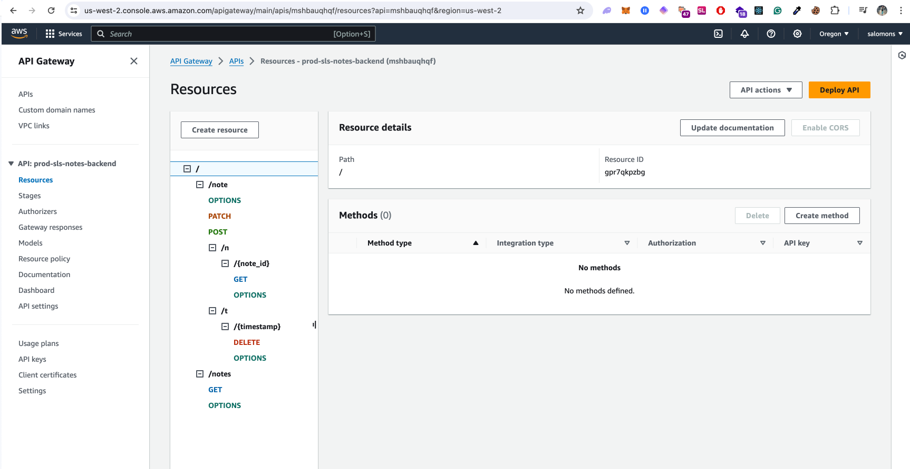

# AWS Serverless REST API

# AWS services used
- IAM roles
- AWS DynamoDB
- AWS CodeCommit
- AWS CodePipeline CI/CD
- AWS Lambda
- API Gateway

# API paths
- Create a note / POST http://api_notes.us.to/prod/note
- Edit a Note / PATCH http://api_notes.us.to/prod/note
- Get All notes / GET  http://api_notes.us.to/prod/note
- GET note by Id  http://api_notes.us.to/prod/note/n/{note_id}
- Delete note / DELETE  http://api_notes.us.to/prod/note/t/{timestamp}

# Exported Postman json API
utils/SLS Notes Backend API.postman_collection.json

How run this project
- Install libraries `npm i`
- You will need creat a IAM user
https://docs.aws.amazon.com/IAM/latest/UserGuide/id_users_create.html
- You will need install and config AWS-CLI in you OS
https://docs.aws.amazon.com/cli/latest/userguide/getting-started-install.html
- If you want to see your user `aws sts get-caller-identity`
- library for deploy DynamoDB `npm install -g serverless`
- Create Backend DynamoDB Table using serverless template `serverless deploy`

# Config Git codecommit
- init repo `git init`
- Create branch master `git checkout -b master`
- Create branch dev `git checkout -b dev`
- add the code for commit `git add .`
- add commit msg `git commit -am "first commit"`
- add this repo to remote repo `git remote add origin https://git-codecommit.us-west-2.amazonaws.com/v1/repos/sls-notes-backend-repo`
-  Verify `git remote -v`
-  check if exist any change `git status`
-  push the code to dev `git push --set-upstream origin dev`
-  push the code to master `git push --set-upstream origin master`
- Repository https://git-codecommit.us-west-2.amazonaws.com/v1/repos/sls-notes-backend-repo
- change default branch `aws codecommit update-default-branch --repository-name sls-notes-backend-repo --default-branch-name master --region us-west-2`

# Run serverless-offiline
`serverless offline`

### Project Architecture:

